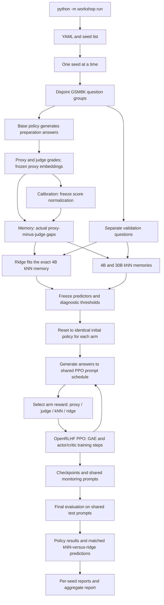

# Workshop kNN Project

Study proxy-reward overoptimization and compare kNN and ridge gap correction
during PPO. The project uses one dataset, **GSM8K**, with one shared policy,
OpenRLHF PPO backend, and evaluation pipeline for every reward method.

OpenRLHF supplies the actor/critic training steps, clipped losses and GAE.
Our single-device strategy supplies the shared model, corrected rewards,
batching and experiment lifecycle. See [the integration graph](docs/OPENRLHF.md).

The Python package is `workshop`; all commands start with `python -m workshop`.
Dataset loading and the default split are configured in `configs/default.yaml`.

```text
workshop_knn_project/
    workshop/          # CLI, models, PPO, reward methods, evaluation and analysis
    configs/           # Experiment configuration
    scripts/           # Launchers sharing one seed-run implementation
    tests/             # CPU unit and integration tests
    requirements.txt   # Pinned Python dependencies
    README.md
    VERIFICATION.md
```

All five default arms train the same Qwen2.5-0.5B policy from the same initial
LoRA weights, using the same prompt schedule and PPO settings. Only the reward
method changes. The untrained base policy is evaluated as an additional baseline.

| Arm | Reward used by the one PPO trainer |
|---|---|
| `proxy` | Normalized Qwen2.5-1.5B proxy grade |
| `judge` | Normalized Qwen3-4B judge grade |
| `knn_static` | Proxy grade minus kNN-predicted 4B gap |
| `knn_static_30b` | Proxy grade minus kNN-predicted 30B gap |
| `ridge` | Proxy grade minus ridge-predicted 4B gap |

## Run

Use Linux x86_64, Python 3.10–3.12 and an NVIDIA driver compatible with CUDA 12.9.
The setup script creates an isolated environment with OpenRLHF 0.9.0, PyTorch
2.8.0/CUDA 12.9 and compatible dependencies. It finishes by running a tiny real
PPO update and exact checkpoint-resume check, without downloading any model.
If the image lacks `nvcc`, setup installs NVIDIA's checksum-verified compiler
redistribution inside the virtual environment; it does not change the GPU driver.
Native Windows is not a supported OpenRLHF training environment; use a Linux
GPU pod or WSL2 with CUDA support.
The full default suite loads the 30B teacher for memory preparation. To omit that
comparison, start a new output with `--arms proxy judge knn_static ridge`.

Clone the repository, then install and run on Linux:

```bash
git clone https://github.com/plero80/WORKSHOP_PROJECT.git workshop_knn_project
cd workshop_knn_project

bash scripts/setup.sh
source .venv/bin/activate

python -m workshop run --dry-run
python -m workshop run
```

The default is one full seed, **42**, with **400 PPO attempts per arm**.
Ridge runs automatically with the other four arms.

**Start a new run after this migration.** Old custom-PPO checkpoints and seed
suites cannot resume under OpenRLHF or be pooled into the same matched suite.
Existing saved results remain available for separate analysis.

After installing the requirements above, **choose one launcher** for a full
seed-42 run in the background:

| GPU | Launch command | Generation batch | Proxy/4B batch | 30B batch |
|---|---|---:|---:|---:|
| B200 | `bash scripts/run_b200.sh` | 256 | 128 | 32 |
| B300 | `bash scripts/run_b300.sh` | 512 | 192 | 64 |

Both use the same five reward arms, 400 attempts per arm, dataset splits and
PPO settings. The small configuration files inherit `configs/default.yaml` and
override only three inference batch limits. The launchers share
`scripts/run_seed.sh` and use the existing `.venv` when available. They do not
install dependencies or change the training implementation.

Outputs stay separate under `outputs/openrlhf_b200/` and `outputs/openrlhf_b300/`. Each contains
`launcher.log`, `seed_42/experiment.log`, reports and `paper_results/` figures.
The process continues after disconnecting while the pod remains running.
Repeat the same launcher to resume an interrupted run; start it only once while
a run is active. Append `--dry-run` to either launcher to print its plan without
creating outputs or starting training.

For custom seeds or foreground execution, the same configuration is available
through the regular CLI, for example:

```bash
python -m workshop run --config configs/b200.yaml --seeds 42 --output outputs/openrlhf_b200
```

Configuration `extends` paths resolve relative to the file declaring them.
The runner saves the fully resolved configuration with each experiment.

The default runtime uses BF16, PyTorch SDPA attention, and fused AdamW updates on
CUDA. Generation batches contain up to 512 answers; proxy/4B grading batches up
to 192; 30B grading batches up to 64. PPO computes old/reference statistics for
up to 16 answers together, while optimizer minibatches remain **8 answers** and
rollouts remain **16 answers**. Gradient checkpointing is disabled to avoid
recomputing activations. These settings prioritize throughput on a GPU with
ample memory. On smaller GPUs, reduce `generation.batch_size`,
`scoring.batch_size`, `teacher30b.batch_size`, and `runtime.ppo_microbatch_size`.
Larger generation/grading limits primarily affect preparation and evaluation;
PPO still samples only its declared 16 answers per attempt. Batch limits are
starting settings, not a measured throughput optimum. Actual throughput depends
on answer lengths and the installed GPU software stack.

Completed grading batches are cached with one durable transaction per batch.
If interrupted during an unfinished batch, only its uncached answers need
grading again. Batch shapes and optimizer kernels can change floating-point
rounding and seeded samples; treat a runtime change as a new experiment, with
the same configuration for every compared method and training seed.

For three seeds:

```bash
python -m workshop run --seeds 42 43 44 --output outputs/three_seeds
```

Seeds run sequentially on one GPU. Their dataset partitions and model revisions
are fixed; policy sampling and optimizer randomness vary. Each seed builds its
own memory, shared by its matched reward methods.

Edit [configs/default.yaml](configs/default.yaml) before starting, or supply
`--config configs/my_run.yaml`. No notebook execution is required. A dry run
prints the plan without loading models, downloading data, or creating outputs;
it is not a GPU or dependency smoke test.

## Logs, resume, and reports

The launcher writes each seed's live log into its output folder. In another terminal:

```bash
tail -f outputs/openrlhf/seed_42/experiment.log
python -m workshop status
```

Run the **same command** again to resume. Keep the same code, configuration,
library versions, output folder, and seed list. Completed training is not
repeated. An interrupted attempt after the last checkpoint may be replayed.

To start with 100 attempts and later continue to the full 400:

```bash
python -m workshop run --stage pilot
python -m workshop run
```

Pilot uses the monitoring cohort only. Final test evaluation fixes the target
and arm list; extending an already finalized run requires a new output folder.
`--updates` specifies the **total target**, not extra attempts.
`--stage prepare` builds calibration, memories and ridge without keeping any PPO
training; a discarded PPO smoke update still tests the runtime.

You may append seeds later with the same configuration and output, for example
`python -m workshop run --seeds 42 43 44`. The existing seed is resumed and newly
added seeds are recorded in `seed_additions.jsonl`.

On Linux, to detach the launcher from the terminal:

```bash
nohup python -u -m workshop run --seeds 42 43 44 --output outputs/three_seeds > launcher.log 2>&1 < /dev/null &
```

Keep the compute instance running and save outputs/model caches on storage you
intend to retain. Detaching a process does not make its files persistent.

## The logic, as nodes and edges



The aim is to correct an inexpensive proxy reward using a limited set of more
expensive judge labels. For each memory answer, the target gap is
`g = z_proxy - z_judge`. kNN averages nearby gaps; ridge learns a regularized
linear map from the **same embeddings to those actual gaps**. It does not imitate
kNN predictions. Both produce `reward = z_proxy - predicted_gap` by default.
PPO then adjusts the policy to increase that reward while penalizing deviation
from the frozen reference model.

Ridge's alpha is selected by question-weighted validation MSE. Its coefficients
are frozen before training; validation and final answers are never added to the
fitting memory. If missing 30B grades shrink the matched teacher memory, ridge
and 4B kNN both use that same retained subset. Ridge adds no judge calls during
PPO; it uses the proxy and the fitted linear prediction.

The optional `knn_refresh` and `oracle` arms use this same trainer. Enable them
explicitly in a new experiment's YAML/arm list; they are not in the default suite.

## Default question and answer counts per seed

All rows below are disjoint question groups. Preparation answers come from the
initial policy. Counts are before any missing-grade exclusions.

| Purpose | Questions | Answers | Use |
|---|---:|---:|---|
| Calibration | 128 | 256 | Freeze means, standard deviations and gap reference |
| Initial memory | 512 | 1,024 | Fit both static kNN and ridge; matched 30B relabeling |
| Validation (`selection`) | 128 | 256 | Ridge alpha, optional kNN tuning, diagnostic cutoffs |
| Monitoring | 128 | 128 per evaluation per policy | Every 25 attempts and at the target |
| PPO pool | 5,000 | 16 per attempt per arm | 8 questions x 2 answers; 6,400 answers over 400 attempts |
| Reserved refresh pool | 512 | Unused by the default static arms | Optional `knn_refresh` |
| Official final test | 1,319 | 1,319 per policy | Base plus all five trained policies |

The default 400-attempt schedule visits 3,200 of the 5,000 PPO-pool questions
per arm. The same scheduled question IDs are used by all arms. Generated answers
can differ as the policies learn. Default kNN is fixed at `k=32`, temperature
`0.05`; ridge searches the alpha grid in the YAML.

## What is saved

| Location under your output folder | Contents |
|---|---|
| `suite_report.md`, `suite_summary.json` | All policy arms, individual seeds, means, seed standard deviations and within-seed differences |
| `suite_predictors.csv` | Matched kNN/ridge predictor metrics, optimistic tail bias and tail coverage aggregated across seeds |
| `seed_42/report.md` | Accuracy, grading coverage, reward diagnostics, paired bootstrap intervals and judge-call budgets |
| `seed_42/predictors/report.md` | kNN and ridge on identical saved answers: MSE, R2, Pearson, Spearman, AUROC, AP and optimistic tail bias; CSV also has RMSE and MAE |
| `seed_42/predictor_policy_comparison.csv` | Shared-base predictor metrics and optimistic tail bias alongside each method's own PPO accuracy |
| `seed_42/predictors/all_predictions.jsonl.gz` | Answers, scores, actual gaps, predictions, corrected rewards, signed residuals, high-gap labels and tail-membership flags |
| `seed_42/prepared/ridge/` | Fitted coefficients, selected alpha, validation scores and label budget |
| `seed_42/arms/` | Checkpoints, adapters, attempt metrics and sampled training answers for each arm |
| `seed_42/evaluations/` | Shared monitoring/final questions, responses, scores and exact proxy features |
| `seed_42/review/ungraded/` | Questions, answers and all failed grader replies for later inspection |
| `seed_42/manifest.json`, `seed_42/data/splits.json` | Code/config/model identity, package versions and exact dataset split |

Regenerate reports with `python -m workshop report --output outputs/openrlhf`.
Selection results are tuning diagnostics. The shared high-gap definition is
chosen using kNN validation before PPO/final evaluation; it can favor kNN on
validation. Both predictors are tested with the same definition. Changing a
decision cutoff does not improve continuous MSE, R2, or ranking AUROC. R2 is not
squared Pearson correlation. Paired bootstrap intervals measure question
uncertainty; training-seed variability is reported separately.

### Optimistic Tail Bias

For **q = 1%, 5%, 10%**, reports calculate:

\[
\operatorname{OptimisticTailBias}_q
= \operatorname{mean}\left(g-\hat g\;\middle|\;\hat g\le Q_q(\hat g)\right).
\]

This is signed underestimation of the actual gap in the **lowest predicted-gap
tail**. With the default signed correction,
`corrected_reward - judge_z = (proxy_z - predicted_gap) - judge_z = gap - predicted_gap`.
A positive value therefore means too much corrected reward, relative to the
judge, on those answers. Negative values mean under-rewarding; zero indicates
no mean bias in that tail. Lower predicted gaps increase reward at a fixed proxy
score; this tail is not necessarily the highest total-reward tail. With optional
`positive_only` correction, the metric still measures gap bias but is no longer
equal to the applied reward error.

Each predictor uses its own prediction quantiles within the **same answer
cohort**. Quantiles use linear interpolation; `<=` includes every cutoff tie,
which can select more than the nominal fraction. Cutoffs use all finite
predictions, including answers with missing grades. Missing actual gaps are
excluded only from the tail average, counted explicitly, and never filled with
zero. No scored tail pairs means `unavailable`. The mean weights answers
equally; distinct question counts are also recorded.

`report.md` shows **MSE + R2 + AUROC + tail bias + PPO accuracy** together.
Prediction metrics in this compact table use shared base-policy answers;
PPO accuracy uses the corresponding method's own answers on those same
evaluation questions. `predictors/report.md` additionally evaluates both
predictors on each trained policy's answers to inspect bias after PPO.
Selection rows remain tuning diagnostics.

Tail cells report scored / selected answer counts. CSV/JSON also record cutoffs,
actual selected fractions, distinct question counts and missing-label counts;
the compressed predictions identify the selected answers. A 1% tail can contain
very few answers, and constant predictions select the whole cohort. No tail
confidence intervals or automatic claims that ridge is worse are made.
Across seeds, reports average per-seed metrics and show sample standard
deviations and contributing seed counts; they do not pool answers across seeds.

These are descriptive metrics: no model refitting, new grading or PPO changes
are required. New runs calculate them automatically. For completed standalone
runs, `python -m workshop report --output outputs/openrlhf` calculates them from saved
answers and features. Validation reports use `gap_validation_v3`, leaving any
older versioned validation report intact. Tail percentages are fixed in the
metric definition and do not tune the reward or classification threshold.

A missing grade never becomes a zero reward. After bounded retries, the complete
case is saved, that reward is excluded, and the run continues. An entirely
ungraded attempt is counted as skipped. If preparation lacks enough labels,
affected arms are explicitly unavailable while other stages continue. Check
successful-update counts and grading coverage when interpreting comparisons.

## Core paper analysis: one command

The core additions from `reward_gap_paper_revision_plan.md` are implemented in
one offline analysis pipeline. A full seed-suite run generates this analysis
automatically after training and final evaluation. To analyze completed outputs
or refresh the paper artifacts separately:

```bash
python -m workshop analyze --output outputs/openrlhf
```

The input can also be a single seed folder, such as `outputs/openrlhf/seed_42`.
The command loads saved answers, embeddings and frozen predictors; it does not
download models, refit ridge, generate answers, change PPO, or call judges.
The new artifacts are written to **`outputs/openrlhf/paper_results/`**. An external
empty folder may be supplied with `--destination`. To omit plots use
`--no-plots`; `--bootstrap-samples 0` omits confidence intervals, while the default
uses the saved configuration's 2,000 question-bootstrap draws.

The analysis includes:

- **Every saved monitoring checkpoint**, the initial policy and final test
  answers. Both frozen kNN and ridge are evaluated on identical answers from
  each policy. A constant baseline uses the mean of the same memory gap labels.
- MSE, RMSE, MAE, R2, Pearson, Spearman, **Kendall tau-b**, high-gap AUROC and AP.
  The high-gap definition is read from the frozen validation record; the
  analysis never searches for a more favorable cutoff.
- **Reward optimism** `g - predicted_gap`: mean, median, population SD, P90,
  P95, P99, maximum, and fractions exceeding 0, 0.5 and 1.0.
- **High-reward tail optimism** at top 1%, 5%, 10% and 20% of corrected reward.
  This differs from the existing bottom-predicted-gap metric, which remains
  available at 1%, 5% and 10%. Both use inclusive ties and explicit coverage.
- Strict and numeric **top-reward correctness** at top 1/5/10/20/50/100%, plus
  correctness AUROC/AP and reward ranking correlations with the judge. Proxy,
  judge, kNN and ridge use the same finite-reward answer population for these
  comparisons. Average precision (AP) is not trapezoidal PR-curve area.
- Error and optimism by **nearest-memory distance quintile**, and Pearson,
  Spearman, Kendall and descriptive linear slopes for length versus predicted
  gap, corrected reward, actual gap and judge score. Tied distances stay together,
  so some quintiles can be empty.
- Full accuracy, optimism, true/predicted gap and memory-similarity trajectories.
  **Peak-to-last changes compare monitoring with monitoring**, never a monitor
  peak against a different test cohort. The final test endpoint stays separate.
  Stars in the accuracy plot mark the highest observed monitoring checkpoint.
- Final question-bootstrap intervals for accuracy, scores, gaps, mean optimism
  and both tail definitions; reward-tail cutoffs are recomputed in each draw.
  Paired accuracy intervals and exact McNemar tests are also exported. Pairwise
  p-values are exploratory and unadjusted; no automatic significance claim is made.
- Per-seed results, cross-seed means/sample SDs, source-file hashes, support
  counts and explicit unavailable-data records.

Canonical outputs:

```text
paper_results/
    report.md
    analysis.json
    tables/
        gap_prediction.csv
        ppo_final_results.csv
        optimization_robustness.csv
        reward_correctness_alignment.csv
        top_reward_accuracy.csv
        distribution_shift.csv
        length_shortcuts.csv
        peak_to_final.csv
        seed_summary.csv
    raw/
        ppo_checkpoint_metrics.csv
        sample_level_metrics.jsonl.gz
    stats/
        bootstrap_cis.json
        significance_tests.json
    figures/
        ... standalone PDF and PNG plots ...
```

Sample records contain the question and answer, both task checks, grades, true
and predicted gaps, corrected reward, optimism, memory distance, neighbor IDs
and gaps for kNN, and ridge projection for ridge. Each row links to its exact
saved feature file and row index instead of duplicating the embedding vector.

These diagnostics describe the frozen **proxy encoder's representations of
changing answers**; they do not measure a changing encoder. The recorded
`mean_optimized_reward` is the actual arm's terminal reward including configured
completion penalties, before token-level KL. Sampled training KL is recorded
separately. The 30B arm uses its own memory/normalization for that objective;
common prediction-quality comparisons still use the 4B judge target.

The analysis uses the existing paired checkpoint evaluations. It does not spend
judge labels on every training rollout. Missing historical features are reported
as unavailable rather than regenerating old responses. Very small tails can
produce unstable or degenerate intervals; support counts remain essential.
Confidence intervals condition on the fitted predictors and observed data;
they do not replace additional training seeds or account for missing-label bias.

This implements the plan's **core analyses**, not its entire research program.
Held-out selection regret needs multiple candidates per prompt; default final
and monitor evaluation generate one. Calibration plots, top-k judge overlap,
ridge-direction mechanism tests, representation/memory-size/weighting ablations,
new training runs and rewriting the paper remain separate extensions. Results
must establish any claim that ridge is less robust or kNN resists overoptimization.

## Where to read the code

| Module | Responsibility |
|---|---|
| `__main__.py`, `suite.py` | User command, sequential seed jobs, aggregate results |
| `run.py` | One preparation, training and evaluation lifecycle for every arm |
| `models.py` | One policy implementation; frozen graders, embeddings and score cache |
| `ppo.py` | Rollout snapshots, minibatch scheduling, shared optimizer and checkpoint persistence |
| `openrlhf_backend.py` | Adapt our models/strategy to the installed OpenRLHF actor/critic training steps and GAE |
| `backend_check.py` | Download-free CUDA update and exact-resume installation check |
| `memory.py` | Normalization, kNN, ridge fitting/prediction and feature archives |
| `teacher_memory.py` | Relabel the same memory using the 30B teacher |
| `data.py` | Disjoint question splits and deterministic rollout scheduling |
| `answers.py`, `numeric.py`, `grading.py` | Shared numeric parsing, two answer checks, grader parsing/review handling |
| `metrics.py`, `validation.py`, `report.py` | Policy comparisons, predictor validation and reports |
| `analysis.py`, `analysis_plots.py` | One CPU pipeline for checkpoint diagnostics, paper tables, uncertainty and figures |
| `assets.py`, `common.py` | Model revisions, environment checks, run identity and file utilities |

The rollout statistics are calculated once. OpenRLHF computes the advantages
once and supplies both clipped losses through its unmodified training-step
methods. The project schedules minibatches and persists the shared optimizer.
It does not start a Ray cluster or vLLM generation engines, and has no second
handwritten PPO loss implementation or dependency on the old project.

Run identity includes the package source. Outputs and checkpoints created with
an earlier package name or a different implementation must keep their original
runner. Use a fresh output directory for the OpenRLHF experiment.

## Offline checks

```bash
python -m pip install pytest
python -m pytest -q
```

Tests use local random tiny Qwen models without downloads. They cover real PPO
updates, frozen references, masked gradients, exact checkpoint continuation,
missing grades, matched ridge fitting, all-arm pilot/full execution, seed
orchestration, reports and running from a copied standalone folder. These checks
do not replace a full GPU run with the configured models.

See [VERIFICATION.md](VERIFICATION.md) for completed checks and their limits.
