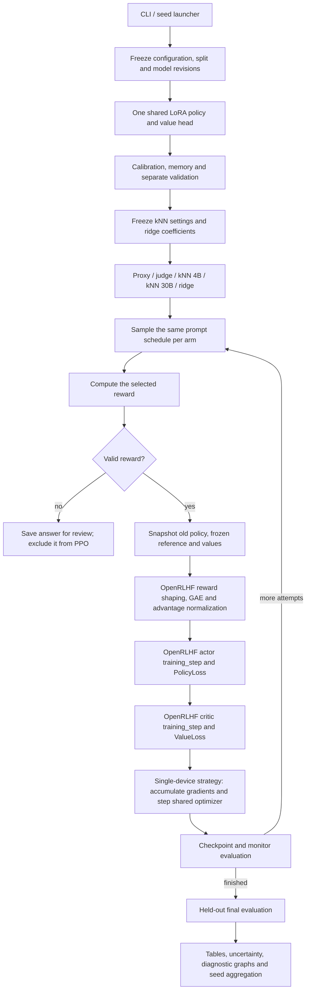

# OpenRLHF integration

All arms use OpenRLHF **0.9.0**, release commit
`06ab51e75c0e8c5b4d6b66912996b2a611e3dc2f`. The version is pinned because
the trainer API is part of the experiment protocol. There is no custom-PPO
fallback. Installing another version produces an actionable startup error.



## What the library implements

- `RemoteExperienceMaker.compute_advantages_and_returns`: terminal rewards,
  fixed reference-KL penalty, GAE, returns and rollout-wide advantage normalization.
- `ActorPPOTrainer.training_step`: clipped policy loss and actor backward call.
- `CriticPPOTrainer.training_step`: clipped value loss and critic backward call.
- `PolicyLoss`, `ValueLoss`, `compute_reward` and `compute_approx_kl`: upstream
  numerical implementations, imported from the installed package.

The worker subclasses specialize initialization for one device. Their training
step methods are inherited unchanged. Upstream's distributed constructors,
replay-buffer loop, Ray scheduler and vLLM generation are not used. vLLM and
DeepSpeed remain installation dependencies because the pinned trainer modules
import them. This is a library integration, not a stock OpenRLHF Ray CLI run.

## What this project implements

Question splits, exact generation tokens, rubric-based grading, score caching,
normalization, gap memory, kNN/ridge prediction, reward correction, seed and
minibatch schedules, evaluation, analysis, and checkpoint persistence.

The actor and value head retain their shared LoRA backbone. The single-device
strategy accumulates actor and value gradients before one AdamW update, scaling
the value loss by the configured coefficient. Each microbatch is weighted by
its valid response-token count. This preserves the declared full-minibatch
objective even with unequal response lengths and partially graded batches.
An update-KL guard is applied before committing an optimizer step.

Numerical details now follow this OpenRLHF release: its KL estimator clamps
individual terms to [-10, 10], and advantage normalization floors the variance
at 1e-8. The logged clip fraction uses the library's clipped-surrogate
definition. These are protocol changes; bitwise equivalence to the previous
handwritten trainer is not claimed.

The frozen reference still uses the base model with LoRA disabled. Generation
uses Transformers and temperature 1; the exact sampled token IDs are passed to
training. Every arm starts from the same initial adapter/value state within a
seed. Ridge remains a normal PPO arm using the same training budget and memory
labels as the 4B kNN arm.

Missing grades are stored for review and excluded. A completely ungraded batch
records a skipped attempt and continues. No dummy scores or padding examples
are introduced to force a fixed batch size.

## Running and reproducibility

```bash
bash scripts/setup.sh
bash scripts/run_b200.sh   # or run_b300.sh
```

The launchers run full seed 42 in the background. Their output roots are
`outputs/openrlhf_b200` and `outputs/openrlhf_b300`. To append seeds after the
current process finishes, activate `.venv` and run:

```bash
nohup python -u -m workshop run --config configs/b200.yaml \
  --seeds 42 43 44 --output outputs/openrlhf_b200 \
  > additional_seeds.log 2>&1 < /dev/null &
```

Use `b300.yaml` and `openrlhf_b300` for the other profile. Keep the code,
environment and configuration frozen between seeds.

`python -m workshop backend-check` verifies real tiny-Qwen actor/value updates
and exact checkpoint continuation before a costly run. Tests also cover CPU
math, variable-length masking and missing grades. These are implementation
checks, not measurements of GSM8K performance or target-GPU throughput.

Manifests record the engine, library version and hashes of the installed
OpenRLHF implementation files. Old `workshop.ppo.v1` checkpoints and suites are
rejected. New runs should be compared within this new protocol; historic results
must keep their original trainer attribution.

A suitable methods description is: “We use OpenRLHF's clipped PPO actor and
critic training steps with a single-device strategy and shared LoRA actor/value
backbone. Our reward correction subtracts a predicted proxy–judge gap from the
normalized proxy score.” Report the configuration alongside that description.

Upstream sources: [actor trainer](https://github.com/OpenRLHF/OpenRLHF/blob/v0.9.0/openrlhf/trainer/ray/ppo_actor.py),
[critic trainer](https://github.com/OpenRLHF/OpenRLHF/blob/v0.9.0/openrlhf/trainer/ray/ppo_critic.py),
[experience processing](https://github.com/OpenRLHF/OpenRLHF/blob/v0.9.0/openrlhf/trainer/ppo_utils/experience_maker.py).
